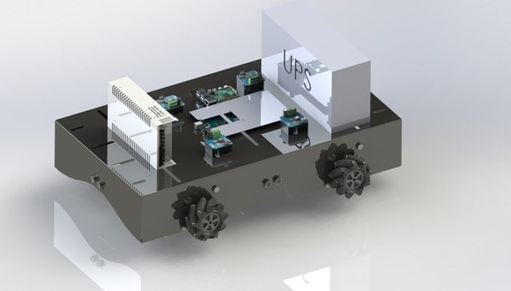

### Karim Negm

Software engineer in Milan. I build things that touch hardware: industrial desktop software, computer vision for inspection, robots, and once a whole game in hand-written x86 assembly.

- **Now:** R&D Software Engineer at Danfoss, working on the PC software used to commission and diagnose servo drives (C#, .NET, WPF/MVVM), tested on real drives over EtherCAT, PROFINET and POWERLINK. That code is closed source, so what's here is university and personal work.
- **Studying:** M.Sc. Automation and Control Engineering at Politecnico di Milano. B.Sc. Mechatronics, Cairo University.

<table>
<tr>
<td width="33%"></td>
<td width="33%"></td>
<td width="33%"></td>
</tr>
<tr>
<td><b>CADBOARD</b>: checks a part against its CAD drawing from a camera image</td>
<td><b>Xonix</b>: two-player arcade game in hand-written x86 assembly</td>
<td><b>ros2-mecanum-bot</b>: ROS 2 drive, odometry and visitor GUI for a tour-guide robot</td>
</tr>
</table>

#### Projects

| Project | What it is | Stack |
|---|---|---|
| [CADBOARD](https://github.com/Negm2000/CADBOARD) | Checks a part against its DXF drawing through an industrial camera and flags four defect types; homography alignment to 3-5 px error. | Python, OpenCV |
| PCB connector inspection for Beko Europe (private, client data under NDA) | Industrial project with Beko's oven plant: per-connector EfficientAD anomaly detection for missing cables. In the team's two-stage pipeline it caught 21 of 25 real defects while passing 98.2% of good connectors. | PyTorch, OpenCV |
| [RNN-pirate-pain-classification](https://github.com/Negm2000/RNN-pirate-pain-classification) | Pain-level classification from motion-capture time series with heavy class imbalance, 0.960 F1 on Kaggle. | PyTorch |
| [Xonix-x86-assembly](https://github.com/Negm2000/Xonix-x86-assembly) | Two-player arcade game written by hand in 16-bit x86 assembly for DOS, about 4,800 lines (2022). | x86 assembly |
| [ros2-mecanum-bot](https://github.com/Negm2000/ros2-mecanum-bot) | `ros2_control` hardware interface over serial and wheel odometry for a mecanum tour-guide robot. B.Sc. graduation project (A+). | C++, ROS 2 |
| [Seesaw](https://github.com/Negm2000/Seesaw) | Balancing an open-loop-unstable cart and seesaw on real Quanser hardware. I designed the pole-placement controller and observer and wrote the test protocol used to compare all controllers. | MATLAB, Simulink |
| [Tram-DC-Drive-Simulink](https://github.com/Negm2000/Tram-DC-Drive-Simulink) | DC traction drive for a 25 t tram with cascaded current/speed control and field weakening. | Simulink |
| [Networked-Control](https://github.com/Negm2000/Networked-Control) | Centralized vs. decentralized vs. distributed LMI control of coupled pendula. | MATLAB, YALMIP |
| [cancer-histopathology](https://github.com/Negm2000/cancer-histopathology) | Team entry that placed 4th of 196 in breast-cancer subtype classification. | PyTorch |
| [Danfoss-Challenge](https://github.com/Negm2000/Danfoss-Challenge) | Log parser that turns messy, multi-line log files into JSON, streaming line by line so memory stays flat on very large files. | C# |

[LinkedIn](https://www.linkedin.com/in/karim-y-negm/) · karim.y.negm@gmail.com
