- **Now:** R&D Software Engineer at Danfoss, working on the PC software used to commission and diagnose servo drives (C#, .NET, WPF/MVVM), tested on real drives over EtherCAT, PROFINET and POWERLINK. That code is closed source, so what's here is university and personal work.
- **Studying:** M.Sc. Automation and Control Engineering at Politecnico di Milano. B.Sc. Mechatronics, Cairo University.
- **Not pictured (client data under NDA):** missing-cable inspection on control boards for Beko Europe's oven plant. In the team's two-stage pipeline it caught 21 of 25 real defects while passing 98.2% of good connectors.

<table>
<tr>
<td width="33%" valign="top"><a href="https://github.com/Negm2000/CADBOARD">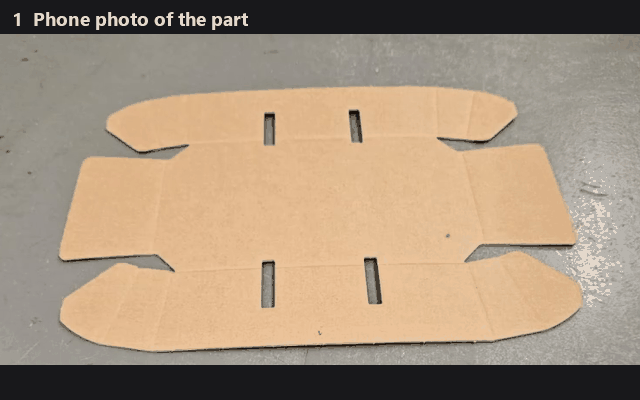</a> <b><a href="https://github.com/Negm2000/CADBOARD">CADBOARD</a></b> A camera checks a part against its CAD drawing and marks what's wrong. Python, OpenCV · team of 2</td>
<td width="33%" valign="top"><a href="https://github.com/Negm2000/Seesaw">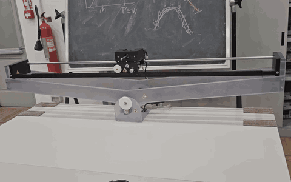</a> <b><a href="https://github.com/Negm2000/Seesaw">Seesaw balancing</a></b> A cart keeps a seesaw level that would tip over on its own, on real lab hardware. MATLAB, Simulink · team of 4, I designed one controller and the test protocol</td>
<td width="33%" valign="top"><a href="https://github.com/Negm2000/Xonix-x86-assembly">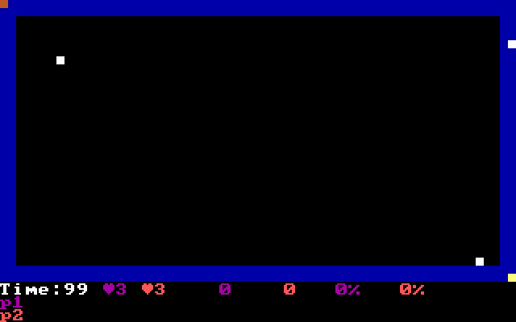</a> <b><a href="https://github.com/Negm2000/Xonix-x86-assembly">Xonix</a></b> Two-player arcade game written by hand in assembly, about 4,800 lines. x86 assembly, runs in DOS</td>
</tr>
<tr>
<td width="33%" valign="top"><a href="https://github.com/Negm2000/ros2-mecanum-bot">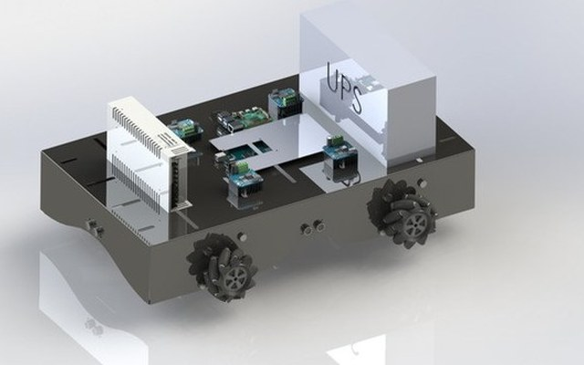</a> <b><a href="https://github.com/Negm2000/ros2-mecanum-bot">Tour-guide robot</a></b> A robot that can drive in any direction. I wrote the motor interface, the odometry and the visitor screen. C++, ROS 2 · B.Sc. graduation project (A+), team of 5</td>
<td width="33%" valign="top"><a href="https://github.com/Negm2000/RNN-pirate-pain-classification">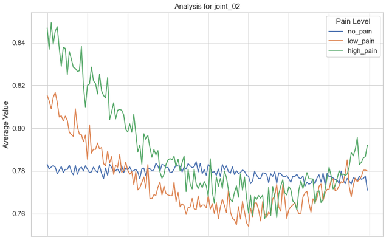</a> <b><a href="https://github.com/Negm2000/RNN-pirate-pain-classification">Pain from motion</a></b> Estimates pain level from motion-capture recordings. 0.960 F1 on Kaggle. PyTorch · team of 4, I built the model</td>
<td width="33%" valign="top"><a href="https://github.com/Negm2000/cancer-histopathology">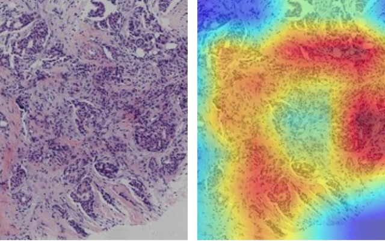</a> <b><a href="https://github.com/Negm2000/cancer-histopathology">Cancer subtypes</a></b> Tells breast-cancer subtypes apart from microscope images. The heat map shows where the model looked. Team entry, 4th of 196. PyTorch · team of 4</td>
</tr>
<tr>
<td width="33%" valign="top"><a href="https://github.com/Negm2000/ATmega32-Star-Framework">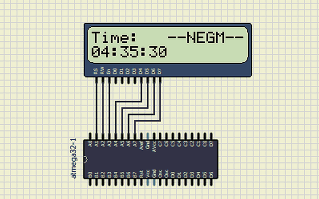</a> <b><a href="https://github.com/Negm2000/ATmega32-Star-Framework">Driver framework</a></b> Drivers for a microcontroller's timer, serial port and display, written from the datasheet. C, ATmega32</td>
<td width="33%" valign="top"><a href="https://github.com/Negm2000/Tram-DC-Drive-Simulink">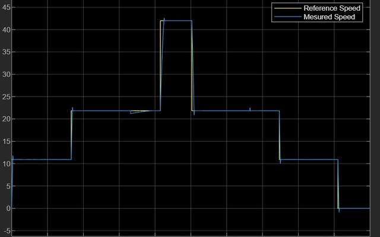</a> <b><a href="https://github.com/Negm2000/Tram-DC-Drive-Simulink">Tram drive</a></b> Speed control for the motor of a 25-tonne tram, in simulation. Simulink</td>
<td width="33%" valign="top"><a href="https://github.com/Negm2000/AVR-Traffic-Light">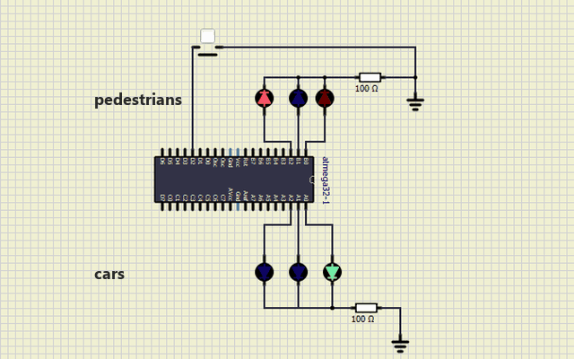</a> <b><a href="https://github.com/Negm2000/AVR-Traffic-Light">Traffic light</a></b> Traffic light with a pedestrian button, running on a bare microcontroller. C, ATmega32 · my own timer and interrupt drivers</td>
</tr>
<tr>
<td width="33%" valign="top"><a href="https://github.com/Negm2000/IACV">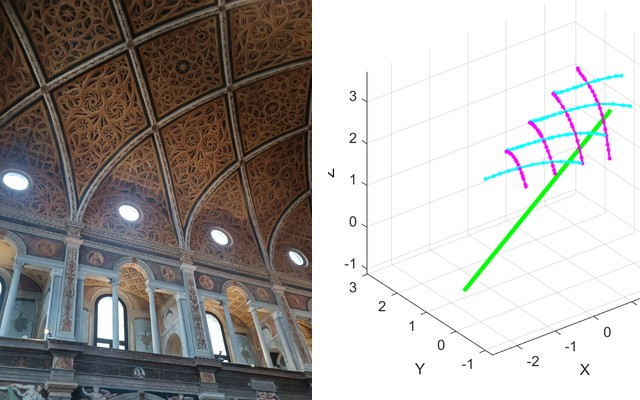</a> <b><a href="https://github.com/Negm2000/IACV">3D from one photo</a></b> A church vault in Milan rebuilt in 3D from a single photo taken with an unknown camera. MATLAB · own work</td>
<td width="33%" valign="top"><a href="https://github.com/Negm2000/exam-autograder">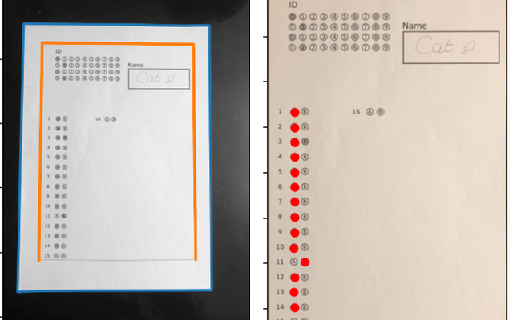</a> <b><a href="https://github.com/Negm2000/exam-autograder">Exam auto-grader</a></b> Grades multiple-choice exam sheets from phone photos. Python, OpenCV · led a team of 4, wrote the bubble-sheet reader</td>
<td width="33%" valign="top"><a href="https://github.com/Negm2000/snakes-and-ladders-cpp">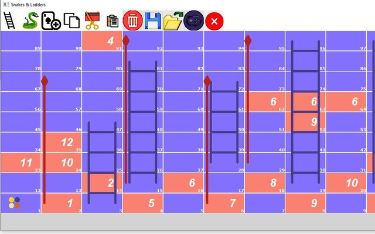</a> <b><a href="https://github.com/Negm2000/snakes-and-ladders-cpp">Snakes &amp; Ladders</a></b> Four-player game with Monopoly-style cards and a board editor. C++ · team of 4, I wrote the play-mode actions and save/load</td>
</tr>
</table>

<b>All projects, with the technical details</b>

| Project | What it is | Stack |
|---|---|---|
| [CADBOARD](https://github.com/Negm2000/CADBOARD) | Checks a part against its DXF drawing through an industrial camera and flags four defect types; homography alignment to 3-5 px error. | Python, OpenCV |
| PCB connector inspection for Beko Europe (private, client data under NDA) | Industrial project with Beko's oven plant: per-connector EfficientAD anomaly detection for missing cables. In the team's two-stage pipeline it caught 21 of 25 real defects while passing 98.2% of good connectors. | PyTorch, OpenCV |
| [RNN-pirate-pain-classification](https://github.com/Negm2000/RNN-pirate-pain-classification) | Pain-level classification from motion-capture time series with heavy class imbalance, 0.960 F1 on Kaggle. | PyTorch |
| [IACV](https://github.com/Negm2000/IACV) | Camera calibration and a metric 3D reconstruction of a church vault from a single uncalibrated photo. | MATLAB |
| [exam-autograder](https://github.com/Negm2000/exam-autograder) | Grades multiple-choice bubble sheets from phone photos with classical image processing. Team project; I wrote the bubble-sheet pipeline. | Python, OpenCV |
| [Xonix-x86-assembly](https://github.com/Negm2000/Xonix-x86-assembly) | Two-player arcade game written by hand in 16-bit x86 assembly for DOS, about 4,800 lines (2022). | x86 assembly |
| [ros2-mecanum-bot](https://github.com/Negm2000/ros2-mecanum-bot) | `ros2_control` hardware interface over serial and wheel odometry for a mecanum tour-guide robot. B.Sc. graduation project (A+). | C++, ROS 2 |
| [ATmega32-Star-Framework](https://github.com/Negm2000/ATmega32-Star-Framework) | Bare-metal GPIO, timer, UART and LCD drivers for the ATmega32, written from the datasheet. | C |
| [AVR-Traffic-Light](https://github.com/Negm2000/AVR-Traffic-Light) | Traffic light with a pedestrian button on an ATmega32, driven by a timer and an external interrupt. Udacity EgFWD Embedded Systems track. | C |
| [Terminal-Payment-Simulator](https://github.com/Negm2000/Terminal-Payment-Simulator) | Card, terminal and server modules of a payment flow in C, with Luhn and expiry checks. Udacity EgFWD Embedded Systems track. | C |
| [Seesaw](https://github.com/Negm2000/Seesaw) | Balancing an open-loop-unstable cart and seesaw on real Quanser hardware. I designed the pole-placement controller and observer and wrote the test protocol used to compare all controllers. | MATLAB, Simulink |
| [Tram-DC-Drive-Simulink](https://github.com/Negm2000/Tram-DC-Drive-Simulink) | DC traction drive for a 25 t tram with cascaded current/speed control and field weakening. | Simulink |
| [Networked-Control](https://github.com/Negm2000/Networked-Control) | Centralized vs. decentralized vs. distributed LMI control of coupled pendula. | MATLAB, YALMIP |
| [cancer-histopathology](https://github.com/Negm2000/cancer-histopathology) | Team entry that placed 4th of 196 in breast-cancer subtype classification. | PyTorch |
| [Danfoss-Challenge](https://github.com/Negm2000/Danfoss-Challenge) | Log parser that turns messy, multi-line log files into JSON, streaming line by line so memory stays flat on very large files. | C# |
| [snakes-and-ladders-cpp](https://github.com/Negm2000/snakes-and-ladders-cpp) | Four-player Snakes & Ladders with Monopoly-style cards, power-ups and a board editor. Team course project; I wrote the play-mode actions and save/load. | C++ |

[LinkedIn](https://www.linkedin.com/in/karim-y-negm/) · karim.y.negm@gmail.com
