

<a href="projects/beko-connector-inspection.md">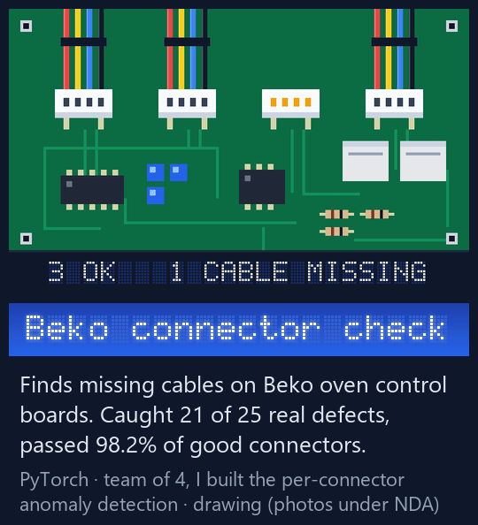</a>
<a href="https://github.com/Negm2000/CADBOARD">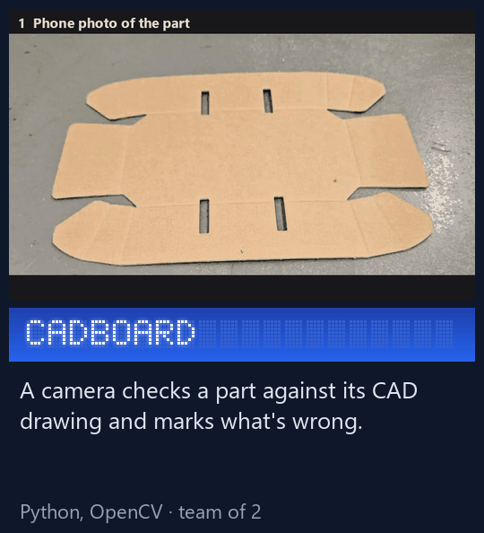</a>
<a href="https://github.com/Negm2000/ros2-mecanum-bot">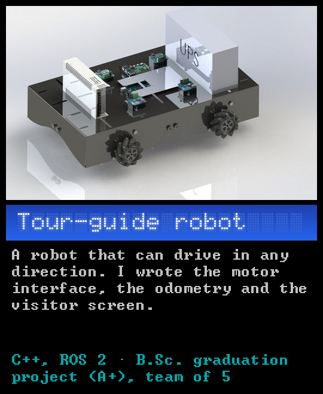</a>
<a href="https://github.com/Negm2000/Seesaw">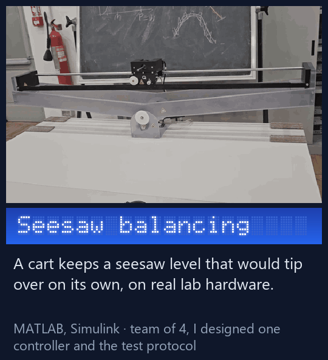</a>
<a href="https://github.com/Negm2000/Xonix-x86-assembly">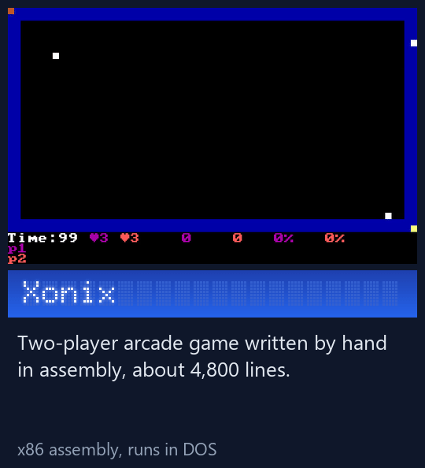</a>
<a href="https://github.com/Negm2000/RNN-pirate-pain-classification">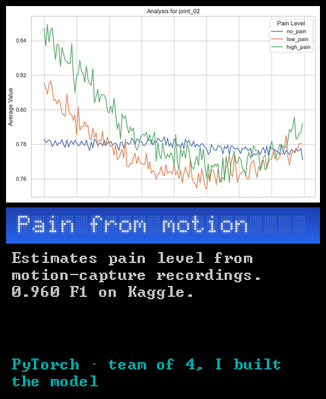</a>
<a href="https://github.com/Negm2000/cancer-histopathology">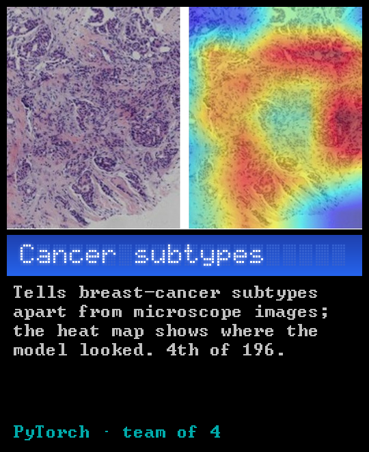</a>
<a href="https://github.com/Negm2000/ATmega32-Star-Framework">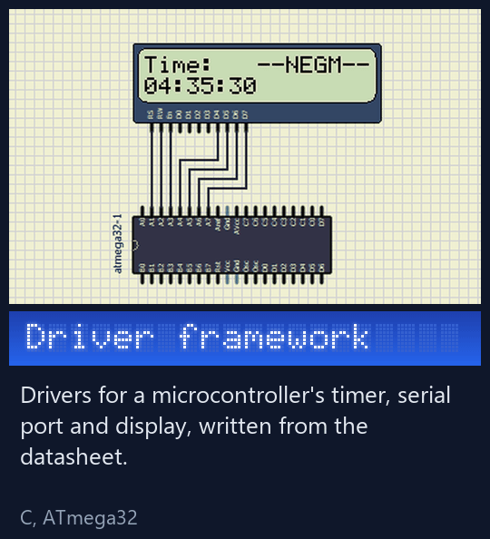</a>
<a href="https://github.com/Negm2000/Tram-DC-Drive-Simulink">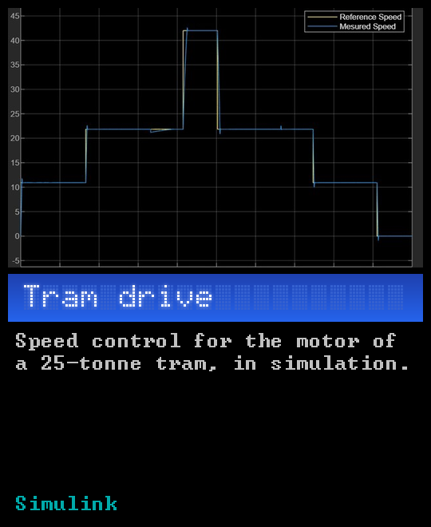</a>
<a href="https://github.com/Negm2000/AVR-Traffic-Light">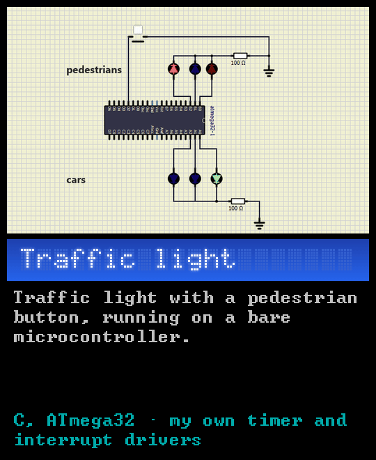</a>
<a href="https://github.com/Negm2000/exam-autograder">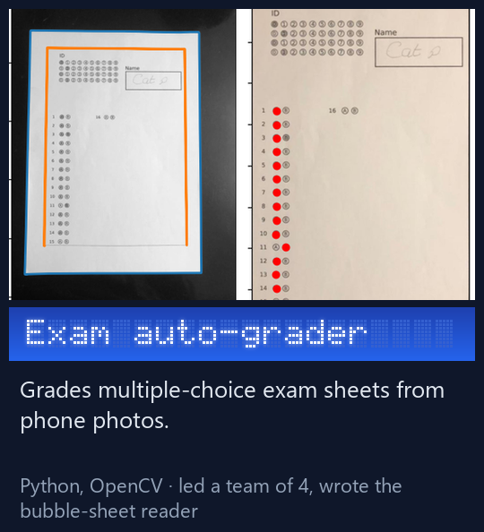</a>
<a href="https://github.com/Negm2000/snakes-and-ladders-cpp">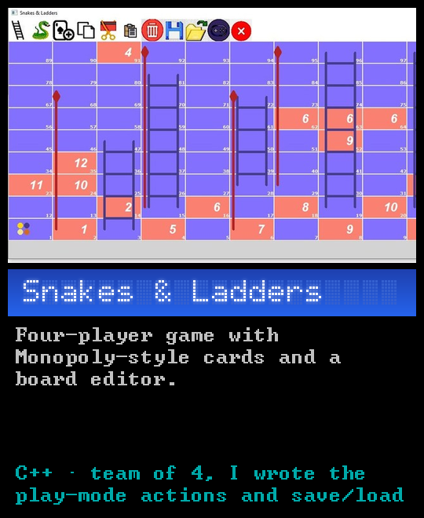</a>

- **Now:** R&D Software Engineer at Danfoss, working on the PC software used to commission and diagnose servo drives (C#, .NET, WPF/MVVM), tested on real drives over EtherCAT, PROFINET and POWERLINK. That code is closed source, so what's here is university and personal work.
- **Studying:** M.Sc. Automation and Control Engineering at Politecnico di Milano. B.Sc. Mechatronics, Cairo University.


<b>All projects, with the technical details</b>

| Project | What it is | Stack |
|---|---|---|
| [CADBOARD](https://github.com/Negm2000/CADBOARD) | Checks a part against its DXF drawing through an industrial camera and flags four defect types; homography alignment to 3-5 px error. | Python, OpenCV |
| [PCB connector inspection for Beko Europe](projects/beko-connector-inspection.md) (code private, client data under NDA) | Industrial project with Beko's oven plant: per-connector EfficientAD anomaly detection for missing cables. In the team's two-stage pipeline it caught 21 of 25 real defects while passing 98.2% of good connectors. | PyTorch, OpenCV |
| [RNN-pirate-pain-classification](https://github.com/Negm2000/RNN-pirate-pain-classification) | Pain-level classification from motion-capture time series with heavy class imbalance, 0.960 F1 on Kaggle. | PyTorch |
| [IACV](https://github.com/Negm2000/IACV) | Camera calibration and a metric 3D reconstruction of a church vault from a single uncalibrated photo. | MATLAB |
| [exam-autograder](https://github.com/Negm2000/exam-autograder) | Grades multiple-choice bubble sheets from phone photos with classical image processing. Team project; I wrote the bubble-sheet pipeline. | Python, OpenCV |
| [Xonix-x86-assembly](https://github.com/Negm2000/Xonix-x86-assembly) | Two-player arcade game written by hand in 16-bit x86 assembly for DOS, about 4,800 lines (2022). | x86 assembly |
| [ros2-mecanum-bot](https://github.com/Negm2000/ros2-mecanum-bot) | `ros2_control` hardware interface over serial and wheel odometry for a mecanum tour-guide robot. B.Sc. graduation project (A+). | C++, ROS 2 |
| [ATmega32-Star-Framework](https://github.com/Negm2000/ATmega32-Star-Framework) | Bare-metal GPIO, timer, UART and LCD drivers for the ATmega32, written from the datasheet. | C |
| [AVR-Traffic-Light](https://github.com/Negm2000/AVR-Traffic-Light) | Traffic light with a pedestrian button on an ATmega32, driven by a timer and an external interrupt. Udacity EgFWD Embedded Systems track. | C |
| [Terminal-Payment-Simulator](https://github.com/Negm2000/Terminal-Payment-Simulator) | Card, terminal and server modules of a payment flow in C, with Luhn and expiry checks. Udacity EgFWD Embedded Systems track. | C |
| [Seesaw](https://github.com/Negm2000/Seesaw) | Balancing an open-loop-unstable cart and seesaw on real Quanser hardware. I designed the pole-placement controller and observer and wrote the test protocol used to compare all controllers. | MATLAB, Simulink |
| [Tram-DC-Drive-Simulink](https://github.com/Negm2000/Tram-DC-Drive-Simulink) | DC traction drive for a 25 t tram with cascaded current/speed control and field weakening. | Simulink |
| [Networked-Control](https://github.com/Negm2000/Networked-Control) | Centralized vs. decentralized vs. distributed LMI control of coupled pendula. | MATLAB, YALMIP |
| [cancer-histopathology](https://github.com/Negm2000/cancer-histopathology) | Team entry that placed 4th of 196 in breast-cancer subtype classification. | PyTorch |
| [Danfoss-Challenge](https://github.com/Negm2000/Danfoss-Challenge) | Log parser that turns messy, multi-line log files into JSON, streaming line by line so memory stays flat on very large files. | C# |
| [snakes-and-ladders-cpp](https://github.com/Negm2000/snakes-and-ladders-cpp) | Four-player Snakes & Ladders with Monopoly-style cards, power-ups and a board editor. Team course project; I wrote the play-mode actions and save/load. | C++ |

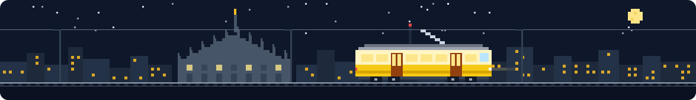
