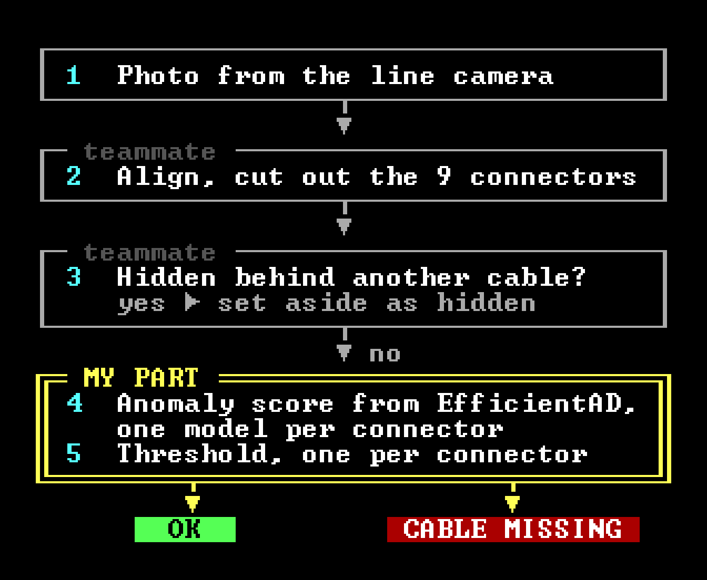
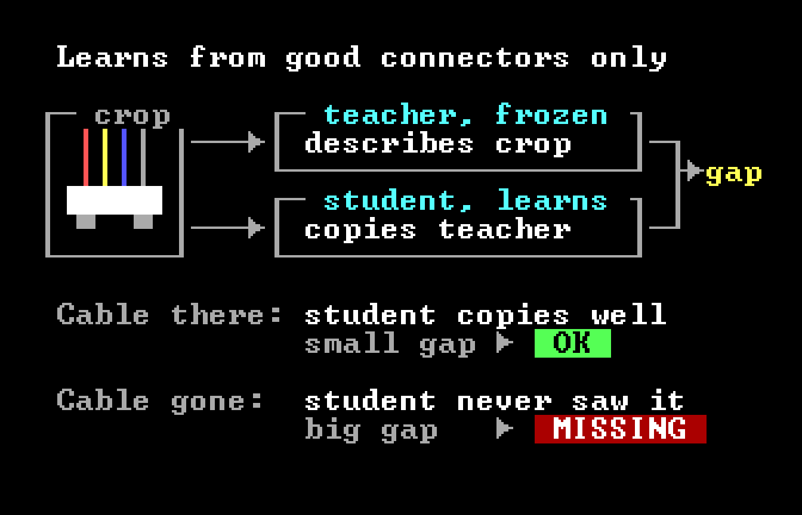
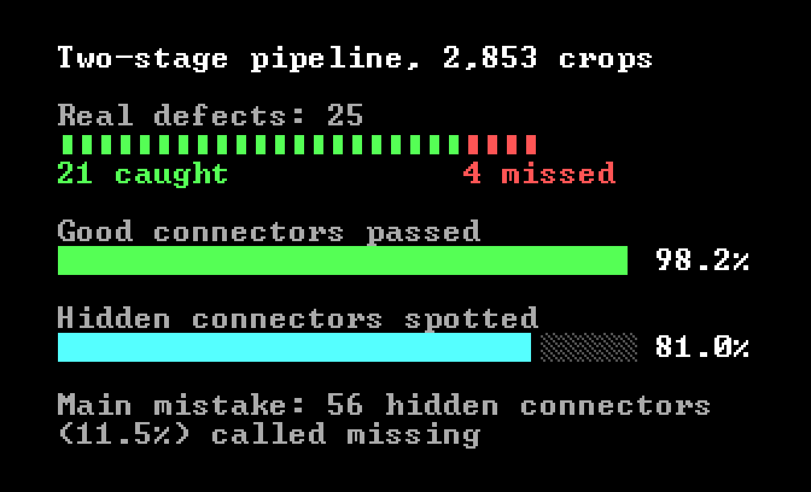

# Connector inspection for Beko Europe

Project work at Politecnico di Milano for Beko Europe's oven plant, September 2025 to February 2026. Team of 4, graded 30/30. My part was the anomaly detector and its thresholds.

**Stack:** Python, PyTorch, anomalib, OpenCV

## The problem

An oven's control board has nine connectors, and each one needs its cable plugged in. A missing cable usually shows up at the end of the line, when the whole oven has to be taken apart to fix it. Beko wanted a camera on the line to catch it while the fix still takes seconds.

What made it hard:

- **Almost no defects to learn from.** There are 2,853 connector photos and only 25 of them show a missing cable, fewer than 5 per connector type.
- **Cables in the way.** Loose cables often hang in front of a connector. To a camera, a hidden connector and an empty one can look alike.
- **Nine different connectors.** Each has its own shape, background and glare.

## The pipeline

My teammates built steps 2 and 3. Step 2 lines every photo up with a reference board, so each connector lands in the same place, and cuts it out. Step 3 sets aside connectors that are hidden behind other cables. The visible ones reach my detector.

## How the detector works

I used EfficientAD, an anomaly detector. It never needs to see a defect. It learns what a good connector looks like and scores how far a new crop is from that.

It has two networks. The teacher is pretrained and frozen, and turns a crop into features. The student is trained to produce the same features, on good crops only. On a good crop the student matches the teacher closely. An empty connector is something it has never seen, so the gap between the two grows, and that gap is the score.

I trained one model per connector type, 70 epochs each, and kept the checkpoint with the fewest false alarms on good crops. Then I set a threshold for each connector from where its good and defective scores fell.

## What it got right, and what it didn't

The detector on its own, before the occlusion step was added:

| Connector | Result |
|---|---|
| 1, 5, 7, 8 | Every defect caught, no false alarms |
| 6 | Missed 3 of 4 defects. The cable is a small part of the crop, so its absence barely moved the score. |
| 9 | Flagged 20 of 66 good crops. Partial occlusions and glare looked as unusual as a missing cable. |

Connector 9 shows the main weakness. An anomaly detector flags anything unusual, and a cable hanging in front of a connector is unusual too. So the team put the occlusion classifier in front of it.

## Results

On all 2,853 crops, the two-stage pipeline caught 21 of the 25 real defects and passed 98.2% of good connectors. Its most common mistake was calling a hidden connector missing: 56 cases, 11.5% of the hidden ones.

## What came after

Hidden connectors were still the weak point, so the team's final system dropped anomaly detection. It uses a supervised classifier per connector, trained on good crops plus fake defects made by painting the cable out of good ones. My teammates built that version. The numbers above are from the two-stage pipeline.

## What's not here

The photos and data are Beko's and under NDA, so the code stays private and this page has no real images. The board at the top is a drawing.

<a href="https://github.com/Negm2000">Back to the profile</a>

